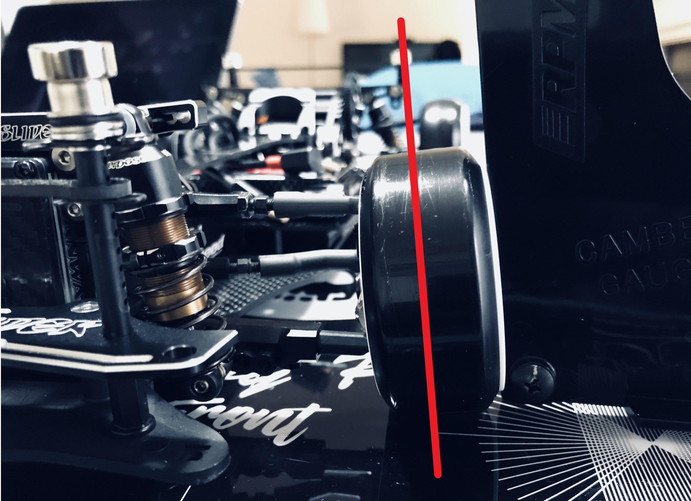

# Basics

## Camber

### What is camber?

Camber angle is the vertical alignment of the wheel relative to the driving surface. At the neutral steering position, the top of the tire should be leaning into the body, which is negative camber. The reference range of negative camber at the neutral steering position is around negative 4 to 8 degrees. I would recommend to set the default around negative 6 and adjust from there. You should have a camber gauge, that can measure from negative 10 to positive 10 degrees. 

So what does camber actually do? When you roll a frisbee on the floor, the frisbee will roll in the direction it is leaning into. Negative camber will assist in stabilizing the chassis in the direction of the lean. For example if camber is zero at neutral, for the chassis to drive straight, it is mechanically less stable than having a negative camber. However, it is very important to have left and right exactly at the same camber, otherwise the chassis will be pulled to whichever that has less camber.

The other key element in RWD RC Drift is the front tire contact patch that is dictated by camber. Using the edge with less contact, or using the larger surface with more contact, on the leading and trailing tires. Typically, more negative camber will increase control, less negative camber will make the steering milder. However, this is relative to how the other alignment is set in combination with camber, and also the profile of your tire.

### How to adjust camber?

